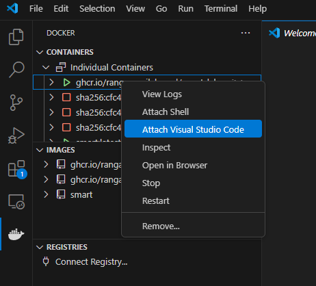

# Spatial Modeling Algorithms for Reactions and Transport (SMART) Tutorial

## Installation

SMART has been installed and tested on Linux for AMD, ARM, and x86_64 systems, primarily via Ubuntu 20.04 or 22.04.
On Windows devices, we recommend using Windows Subsystem for Linux to run the provided docker image (see below).
SMART has also been tested on Mac OS using docker.
Installation using docker should take less than 30 minutes on a normal desktop computer.
For more details on SMART, please see the [main SMART repository](https://github.com/RangamaniLabUCSD/smart).

### Using Docker (recommended)

1. Install [Docker Desktop](https://www.docker.com/products/docker-desktop/) for Windows, Mac, or Linux. In Windows, it is recommended to use Docker with the WSL2 backend, requiring you to first [install WSL2](https://learn.microsoft.com/en-us/windows/wsl/install) and then follow the [Docker instructions for using the WSL2 backend](https://docs.docker.com/desktop/features/wsl/).
2. From your command line (WSL, Mac, or Linux), pull the desired Docker image from the Github registry:
    ```
    docker pull ghcr.io/rangamanilabucsd/smart:latest
    ```
    It is possible to pull a specific version by changing the tag, e.g.
    ```
    docker pull ghcr.io/rangamanilabucsd/smart:v2.0.1
    ```
    will use version 2.0.1.

3.  In order to start a container you can use the [`docker run`](https://docs.docker.com/engine/reference/commandline/run/) command. For example the command
    ```
    docker run -v $(pwd):/home/shared -w /home/shared -ti --name smart-tutorial ghcr.io/rangamanilabucsd/smart:latest
    ```
    will run the latest version and mount your current working directory within the container at the location `/home/shared`.
    `$(pwd)` can be replaced with any local directory on your computer. Within the container, you will then be accessing that same content from your local directory at the location `/home/shared`.
    The source code of SMART is located at `/repo` in the Docker container.
    Note: including the option `--rm` will automatically delete the Docker container upon closing. I generally do not include this, allowing me to stop and restart the container at any point using Docker Desktop, without needing to create a new container each time (see image below) 

4. (recommended workflow in VS Code) SMART can be run within the Docker container from the command line, but I find it most convenient to run in VS Code. To do this, install VS Code for [Windows with WSL](https://learn.microsoft.com/en-us/windows/wsl/tutorials/wsl-vscode), or [Mac or Linux](https://code.visualstudio.com/download). In Windows, open VS Code from within WSL (`code .` from within Ubuntu or other distribution), or simply open the program normally within Mac or Linux systems. Install the Docker and Dev Container extensions. From within the Docker extension (look for the Docker icon on the left bar), right click on the running container and select "Attach Visual Studio Code".  

    This will open a new window attached to the Docker container, where you can access files in the container and run associated code. Within this new window, you should minimally install the Python and Jupyter extensions.

#### Alternate Docker option - Jupyter Lab

SMART can be run with Jupyter Lab in your web browser if preferred.

1. Install Docker as outlined above.
2. To run the example notebooks, one can use `ghcr.io/rangamanilabucsd/smart-lab`
```bash
docker run -ti -p 8888:8888 --rm ghcr.io/rangamanilabucsd/smart-lab
```
to run interactively with Jupyter lab in your browser.

#### Note on converting notebooks to Python files
In the `smart` and `smart-lab` images, these files exist under `/repo/examples/**/example*.py`.

If you clone the git repository or make changes to the notebooks that should be reflected in the python files, you can run
```bash
python3 examples/convert_notebooks_to_python.py
```
to convert all notebooks to python files. **NOTE** this command overwrites existing files.

### Singularity installation (recommended for shared servers)

In some cases (such as on shared servers), it may not be possible to use docker to run `smart` due to the requirement for root privileges to run docker.
An easy workaround involves using the alternative containerization software, Singularity.
The following strategy still builds from the Docker image, but allows you to build a Singularity container on your local system that can be transferred readily to a directory on your shared server.

1. If you do not have Singularity installed, follow the instructions at https://sylabs.io/guides/latest/admin-guide/installation.html on your local machine and on the shared server.
2. Write a singularity definition file using the SMART docker image, should include the following:
    ```
    Bootstrap: docker
    From: ghcr.io/rangamanilabucsd/smart:latest
    %post
        # install other tools if needed for your purposes
    %runscript
        echo "Welcome to the SMART Singularity container"
        exec /bin/bash -i "$@"
        source $FENICS_HOME/.bashrc
    %environment
        # set desired environment variables
        export FENICS_HOME=/root
        export PYTHONPATH=$PYTHONPATH:$SMARTDIR # set this if you mount a local version of SMART in SMARTDIR
        export HOME=$FENICS_HOME
        export DIJITSO_CACHE_DIR=/root/tmp # tmp files will be written to here during FEM assembly
        export MPLCONFIGDIR=/root/tmp # for use of MATPLOTLIB
        export RDMAV_FORK_SAFE=True # req'd for some parallelization
    ```
3. Build singularity container on a local machine where you have root access: 
    ```
    sudo singularity build smart.sif singularity-recipe.def
    ```
    where singularity-recipe.def is a text file containing the above recipe.
4. Transfer smart.sif to the server you wish to run on (e.g. using rsync).
5. Login to the server and run the Singularity container. The following lines mount the env var TMPDIR as the tmp directory in the singularity container and mounts HOME at /root/shared in the container (for access to your scripts, saving files, etc.). You may wish to mount additional directories which can easily be appended to the singularity run or singularity exec call. \
For an interactive job use:
    ```
    singularity run --bind $HOME:/root/shared,$TMPDIR:/root/tmp smart.sif
    ```
    In a bash script, you can call the singularity container and your script using:
    ```
    singularity exec --bind $HOME:/root/shared,$TMPDIR:/root/tmp smart.sif python3 /path_to_python_script.py
    ```
    In certain cases, it may be useful to provide `--cleanenv` as an option when running. This and other details can be found within the [Singularity documentation](https://docs.sylabs.io/guides/3.1/user-guide/cli/singularity.html#singularity).


### Using pip
`fenics-smart` is also available on [pypi](https://pypi.org/project/fenics-smart/) and can be installed with
```
python3 -m pip install fenics-smart
```
However this requires FEniCS version 2019.2.0 or later to already be installed. Currently, FEniCS version 2019.2.0 needs to be built [from source](https://bitbucket.org/fenics-project/dolfin/src/master/) or use some of the [pre-built docker images](https://github.com/orgs/scientificcomputing/packages?repo_name=packages). It is also possible to use Spack to install a development version of FEniCS on shared servers (sample recipe [here](https://gist.github.com/finsberg/a2d1b62dc57763173ba045551090a2ee)).

## Getting started with SMART

A minimal example can be accessed ON [this page](https://rangamanilabucsd.github.io/smart/docs/getting_started.html) and is also included (with some variants) within this repository.
Once you have followed the above instructions to install SMART, you can download this repository and place it in a mounted folder within your Docker or singularity container.
You can then run `smart_minimal.ipynb` within the container, either from the terminal or from within an attached window of VS Code.
To run as a python file, you should first convert the Jupyter notebook using `jupyter nbconvert --to script smart_minimal.ipynb` from within the repository folder.

The SMART repository contains a number of additional examples in the `examples` directory which also run as continuous integration tests. Within any of the installed containers, these can be accessed in `/repo/examples` and run locally.
* [Example 1](https://rangamanilabucsd.github.io/smart/examples/example1/example1.html): Formation of Turing patterns in 2D reaction-diffusion (rectangular domain)
* [Example 2](https://rangamanilabucsd.github.io/smart/examples/example2/example2.html): Simple cell signaling model in 2D (ellipse)
* [Example 2 - 3D](https://rangamanilabucsd.github.io/smart/examples/example2-3d/example2-3d.html): Simple cell signaling model in 3D (realistic spine geometry)
* [Example 3](https://rangamanilabucsd.github.io/smart/examples/example3/example3.html): Model of protein phosphorylation and diffusion in 3D (sphere)
* [Example 4](https://rangamanilabucsd.github.io/smart/examples/example4/example4.html): Model of second messenger reaction-diffusion in 3D (ellipsoid-in-an-ellipsoid)
* [Example 5](https://rangamanilabucsd.github.io/smart/examples/example5/example5.html): Simple cell signaling model in 3D (cube-in-a-cube)
* [Example 6](https://rangamanilabucsd.github.io/smart/examples/example6/example6.html): Model of calcium dynamics in a neuron (sphere-in-a-sphere)
